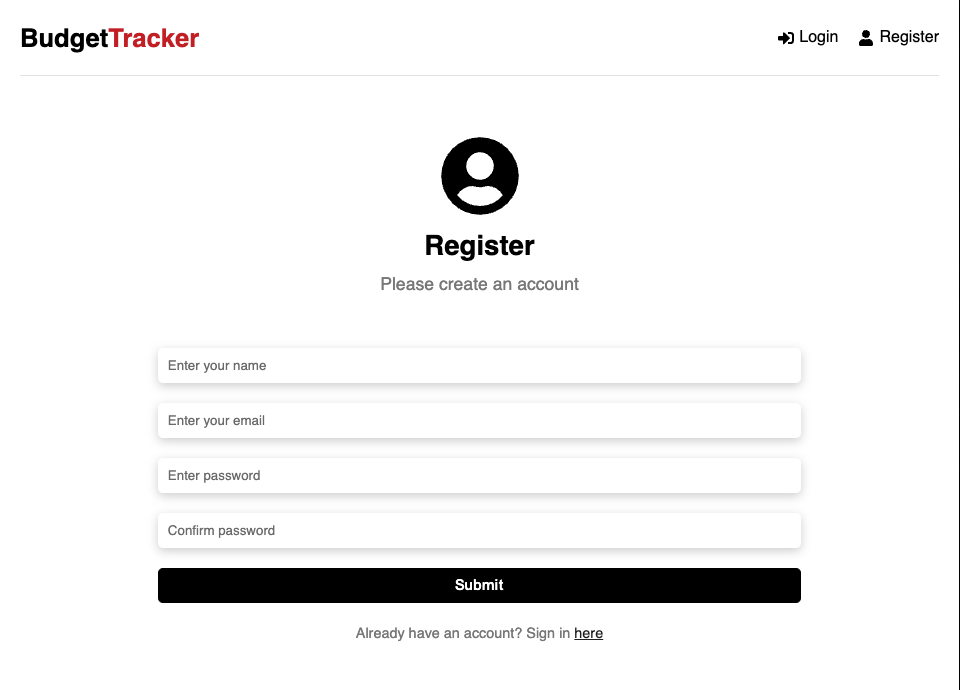
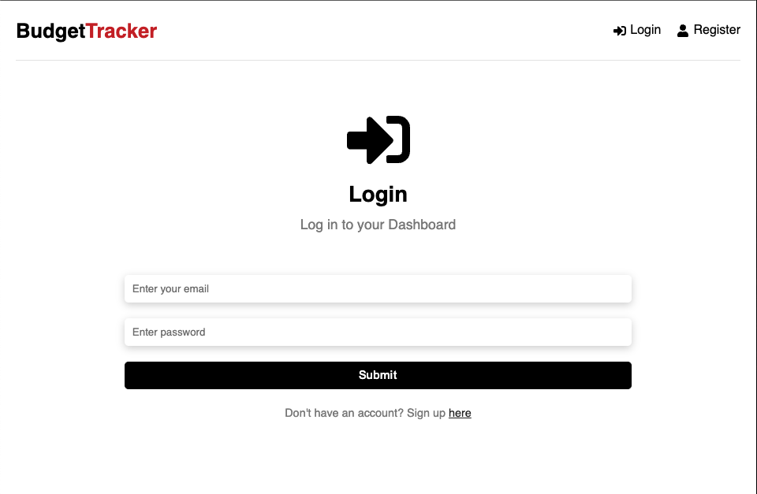
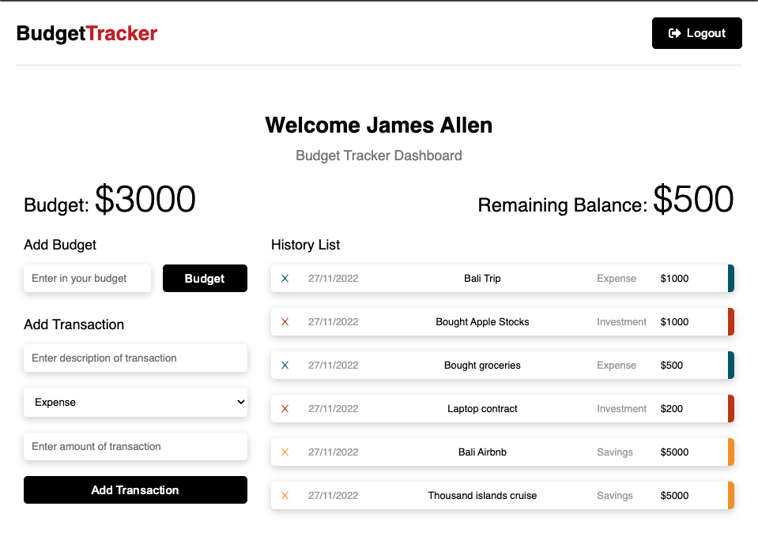
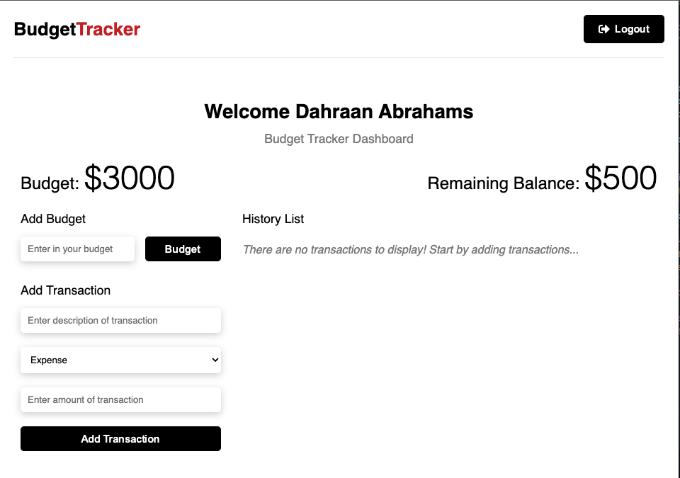

# react-TodoList-app
Fullstack React app that allows user to track their budgets.
The frontend was created using ReactJS. The backend was created using NodeJS with a MongoDB database.

<h1>Usage</h1>

<h4 style="font-weight: lighter">Create a .env file in the root directory with the following content: </h4>

  
 
   &emsp;NODE_ENV = development  
   &emsp;PORT = 5000  
   &emsp;MONGO_URI = mongodb+srv://YOURMONGOURI  
   &emsp;JWT_SECRET = budgetTracker123 
   

<h1>Install Dependencies</h1>

<h4>Backend Dependencies</h4>
  
&emsp;npm install

<h4>Frontend Dependencies</h4>
  

  &emsp;cd frontend  
  &emsp;npm install
  

<h1>Run Server</h1>
  
npm run server
